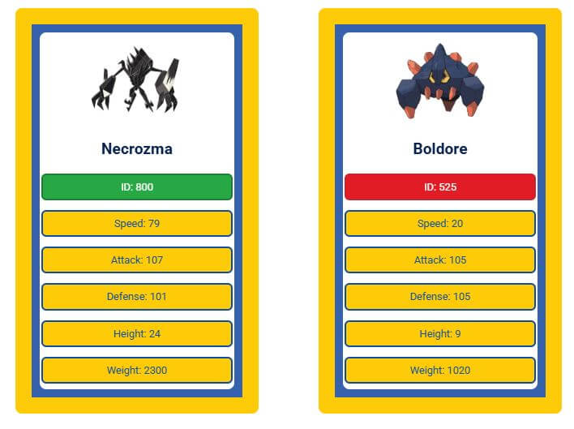
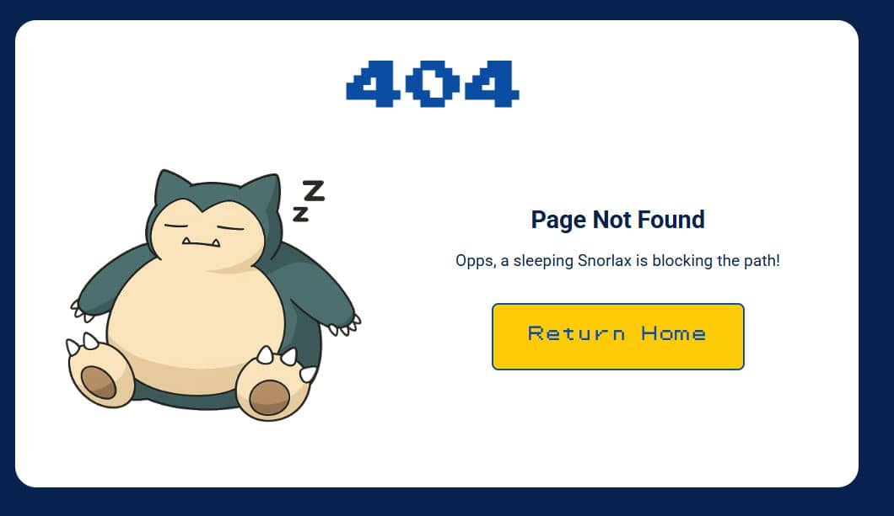
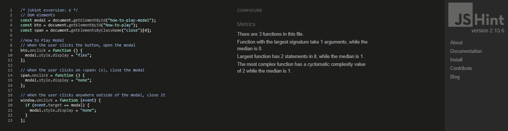
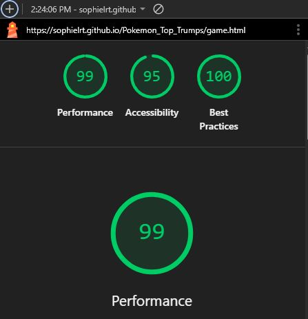
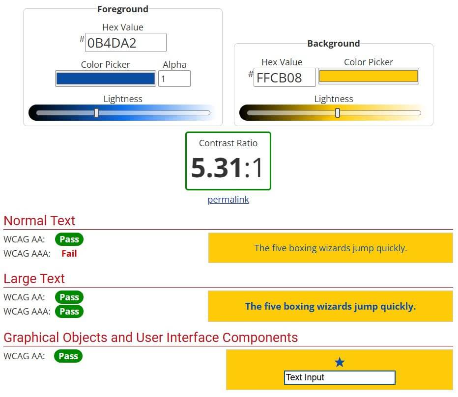
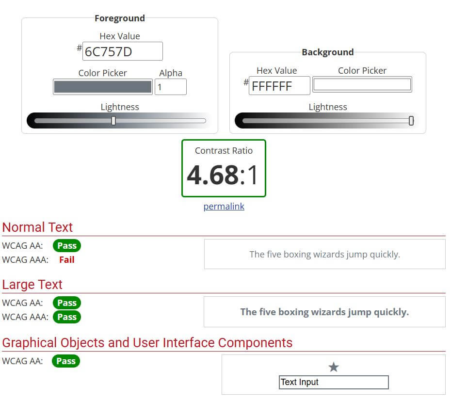

# Battle Academy Pokémon Top Trumps


Battle Academy Pokémon Top Trumps is an interactive card game where the user competes against the computer using a Pokémon card. The website randomly selects a Pokémon from the first 898 in the [PokeAPi](https://pokeapi.co/), displaying their image and stats including ID, Speed, Attack, Defense, Height and Weight. The game tracks the score through 5 rounds, and at the end, asks the user if they would like to play again.

The site also features game instructions, social media buttons and a 404 page. However, this is only the first iteration of the Battle Academy Top Trumps website - additional sections including High Scores, Enter Name, on-Screen Winner, Loser or Draw animation, and Score continuation through rounds will be added in the future.

## [Live Website](https://sophielrt.github.io/Pokemon_Top_Trumps/)

## Code Institute - Milestone Two Project: Interactive Frontend Development

This website was developed for my Milestone Two project to showcase my ability to build and design a dynamic, interactive front-end site using HTML, CSS and JavaScript.

## Table of contents
1. [Project Planning](#project-planning)
   - [Gantt Chart](#gantt-chart)
   - [Flow Chart](#flow-chart)
2. [UX](#ux)
   - [Business Goals](#business-goals)
   - [Target Users](#target-users)
   - [User Stories](#user-stories)
   - [Design Choices](#design-choices)
   - [Wireframes](#wireframes)
3. [Final Website UI](#final-website-ui)
   - [Homepage UI](#homepage-ui)
   - [Ready to Play UI](#ready-to-play-ui)
   - [Game UI](#game-ui)
   - [404 Page UI](404-page-ui)
4. [Features](#features)
5. [Technologies](#technologies)
6. [Testing](#testing)
   - [Manual Testing](#manual-testing)
   - [Vaildator Testing](#vaildator-testing)
   - [Google Lighthouse Testing](#google-lighthouse-testing)
   - [WebAIM Contrast Checker](#Webaim-contrast-checker)
7. [Bugs](#bugs)
8. [Deployment](#deployment)
9. [Credit](#credit)
   - [Content](#content)
   - [Media](#media)
   - [Typography](#typography)
   - [Code](#code)
   - [README File](#readme-file)
   - [Inspiration](#inspiration)
   - [Acknowledgements](#acknowledgements)

## Project Planning

### Gantt Chart


This document outlines the project schedule for Milestone 2, spanning seven weeks of development activities. Meeting each development activity deadline is key in order to reach the final deadline date of the project in time and complete all the project criteria.

### Flow Chart


A flow chart has been created to show the user navigation structure and decision-making process throughout the game. This was made before the wireframes to help understand the layout of the game and how the user would navigate through each stage. This visual representation maps out the complete user journey starting from entry to the homepage to finishing the last round of the game and deciding to play again or return to the homepage.

## UX
The user experience (UX) of Battle Academy Pokémon Top Trumps has been carefully designed to prioritise a simple, engaging and visually appealing gaming experience. The design draws inspiration from the original Pokémon games to create an authentic and nostalgic feel, ensuring a fun and memorable experience for users.

### Business Goals
1. Attracting Potential Users
   - Ensure relevant metadata is used for search engine Optimisation (SEO) to reach users searching for Pokémon Top Trump Games.

2. Engaging Potential Users
   - Create a user-friendly site that is easy to navigate.
   - Make instructions simple and easy to understand so users can quickly start the game.
   - Ensure the content is suitable for the target audience.
   - Include key information that the user needs to enjoy and understand the game.

3. Visual Design 
   - Use high-quality images to showcase Pokémon and enhance visual appeal.
   - Maintain a consistent Pokémon-inspired colour palette and typography throughout the website.
   - Include visual feedback on buttons (hover effect) to improve user experience.

4. Speed Optimisation
   - Ensure the website is fast-loading and fully responsive for a smooth user experience across all devices.

5. Engagement
   - Include a clear call to action "Start Game" button on the homepage to encourage immediate engagement.
   - Include a play again option on the end-of-game summary to increase replay value.


### Target Users
1. #### Pokémon fans
   - Fans who enjoy collecting Pokémon cards and comparing different Pokémon
   - Know Pokémon stats, types and evolution chains
   - Play different Pokémon games across different platfroms
   - Appreciate authenic Pokémon data and artwork
   - Competitive and enjoy testing their knowledge

2. #### Casual gamers
   - Plays games on various different devices
   - Enjoy games they can pick up and put down easily
   - Value quick enterainment over complex games
   - Don't want to commit to long gaming sessions
   - Pefers to play games that don't require long tutorials

3. #### Noatalgia seekers
   - Grew up playing up play physical Top Trump cards in the 80s, 90s or 2000s
   - Grew up collecting Pokémon cards
   - Appreciates retro games
   - Values authentic recreations of childhood experinces

### User Stories
1. As a Pokémon fan, I want to see design inspiration from original Pokémon games.
2. As a Pokémon fan, I want to see authentic and correct Pokémon data.
3. As a casual gamer, I want a game which works on different devices, so I can play at home or on the go.
4. As a casual gamer, I want a game which I can play quick rounds off.
5. As a casual gamer, I want simple rules that are easy to understand so I can quickly get into the game.
6. As a nostalgia seeker, I want the cards to flip so I can relive memories. 
7. As a nostalgia seeker, I want straight forward game play without all the complexities that typically come with modern gaming.


### Design Choices 


1. Typography
   - The Pokémon font by FontGet was selected for the main headings on the website because it closely replicates the original Pokémon logo style. Using this font for headings creates a fun, colourful, and nostalgic aesthetic that immediately engages users. Its distinctive style makes headings stand out and it resonates with both past Pokémon and present Pokémon fans by evoking familiarity and nostalgia.
   - The Pokémon GB Font by Jackster Productions was chosen for buttons and headings because it replicates the font used in the original Pokémon Game Boy games. This choice reinforces the nostalgic feel of the website, connecting users to the classic Pokémon experience while maintaining a playful aesthetic.
   - Roboto has been selected as the primary font for the website's content due to its modern, clean, and friendly visual tone, making it well-suited for displaying large amounts of text. It offers excellent legibility and high accessibility, while also being widely supported across all major browsers. Roboto's balanced design complements the playful Pokémon replica fonts and colourful aesthetic of the Website.

2. Colour Palette
   - The colour palette was selected to align with the overall Pokémon theme of the website. 
   - These colours were inspired by Pokémon Go and Pokémon Unite. Additional colours have been used to indicate whether the user has won, drawn, or lost, which are not specific Pokémon Colours. 
   - The colour palette creates a visually recognisable and engaging experience for users. These vibrant tones reflect the playful and adventurous nature of the Pokémon universe while helping to create an exciting and immersive gaming environment.

3. Images
- All images were selected carefully to ensure they are high-quality.
- Images were chosen to match the theme of the website, maintaining consistency and visual appeal.

### Wireframes
I designed the wireframe using [Balsamiq](https://balsamiq.com/?gad_source=1&gad_campaignid=203404003&gbraid=0AAAAAD3BuzM2dIpvaCG11kLamcF5Q3KgV&gclid=CjwKCAjwpOfHBhAxEiwAm1SwEiPicpKTgCI5qsO_ClQq3fiPralCRYTT2TKyBPkgk5S44vDQfpmleRoCkLEQAvD_BwE).

This is only the first iteration of the Battle Academy Top Trumps website. The High scores, Name, and Game Results sections will be added in the future.

1. [Homepage](./assets/readmefile-assets/home-page-wireframe.png)
2. [How to Play](./assets/readmefile-assets/how-to-play-wireframe.png)
3. [High Scores](./assets/readmefile-assets/high-score-wireframe.png)
4. [Are you Ready to Battle your Opponent?](./assets/readmefile-assets/preparing-for-battle-wireframe.png)
5. [Name](./assets/readmefile-assets/name-wireframe.png)
6. [Game](./assets/readmefile-assets/game-wireframe.png)
7. [Game Results](./assets/readmefile-assets/game-results-wireframe.png)
8. [Results module](./assets/readmefile-assets/result-module-wireframe.png)

## Final Website UI

### Homepage UI

User Story 1: "As a Pokémon fan, I want to see design inspiration from original Pokémon games." This page uses 2 Pokémon replica fonts, Pokémon inspired colour palette from Pokémon Go and Pokémon Unite and has a Pokémon card themed background image. The User Interface of this page answers user story 1.

User Story 3: "As a casual gamer, I want a game which works on different devices, so I can play at home or on the go." The homepage is responsive for different devices, meaning that the user can play on phone, iPad, tablet, laptop or desktop, meaning that the game meets the requirements of user story 3.


User Story 1: "As a Pokémon fan, I want to see design inspiration from original Pokémon games." This page uses a 
Pokémon replica font and Pokémon inspired colour palette from Pokémon Go. The User Interface of this page answers user story 1.

User Story 5: "As a casual gamer, I want simple rules that are easy to understand so I can quickly get into the game." This page has a simple layout and shows rules in easy bite-sized bullet points. Sections on this page include Objective, Game Setup, How to Play, Strategic Thinking and Game Controls. The sections have been clearly highlighted to make it quick to read to help users start the game as quickly as possible. The User Interface of this page answers user story 5.

User Story 3: "As a casual gamer, I want a game which works on different devices, so I can play at home or on the go." The How to Play Guide is responsive for different devices, meaning that the user can play on phone, iPad, tablet, laptop or desktop, meaning that the game meets the requirements of user story 3.

### Ready to Play UI

User Story 1: "As a Pokémon fan, I want to see design inspiration from original Pokémon games." This page uses 2 Pokémon replica fonts, Pokémon inspired colour palette from Pokémon Go and Pokémon Unite and has a Pokémon card themed background image. The User Interface of this page answers user story 1.

User Story 3: "As a casual gamer, I want a game which works on different devices, so I can play at home or on the go." The ready to Play page is responsive for different devices, meaning that the user can play on phone, iPad, tablet, laptop or desktop, meaning that the game meets the requirements of user story 3.

### Game UI

User Story 1: "As a Pokémon fan, I want to see design inspiration from original Pokémon games." This page uses 2 
Pokémon replica font and Pokémon inspired colour palette from Pokémon Go and Pokémon Unite and the Pokémon cards contain a Pokéball image. The User Interface of this page answers user story 1.

User Story 3: "As a casual gamer, I want a game which works on different devices, so I can play at home or on the go." The Game is responsive for different devices, meaning that the user can play on phone, iPad, tablet, laptop or desktop, meaning that the game meets the requirements of user story 3.


User Story 1: "As a Pokémon fan, I want to see design inspiration from original Pokémon games." This page uses a
Pokémon replica font and Pokémon inspired colour palette from Pokémon Go. The User Interface of this page answers user story 1.

User Story 5: "As a casual gamer, I want simple rules that are easy to understand so I can quickly get into the game." This page has a more concise version of the How to Play guide from the home page, making it quick to refresh the user's memory, as it contains all the key points. This page has a simple layout and shows rules in easy bite-sized bullet points. Sections on this page include How to Play, Stats Explained, Strategy Tips and Scoring. The sections have been clearly highlighted to make it quick for the user to find the points they need. The User Interface of this page answers user story 5.

User Story 7: "As a nostalgia seeker, I want straightforward game play without all the complexities that typically come with modern gaming." The game is easy to start with a simple start button. The UI of the game play is straightforward and very nostalgic. The User Interface of this page answers user story 7.

User Story 3: "As a casual gamer, I want a game which works on different devices, so I can play at home or on the go." The Game is responsive for different devices, meaning that the user can play on phone, iPad, tablet, laptop or desktop, meaning that the game meets the requirements of user story 3.


User Story 1: "As a Pokémon fan, I want to see design inspiration from original Pokémon games." This page uses 2 
Pokémon replica font and Pokémon inspired colour palette from Pokémon Go and Pokémon Unite and the Pokémon cards contain a Pokéball image and an image of a Pokémon from the PokeAPI. The User Interface of this page answers user story 1.

User Story 2: "As a Pokémon fan, I want to see authentic and correct Pokémon data." This page contains data from the PokeAPI, this is a database which contains information about all Pokémon from the Pokédex. The User Interface of this page answers user story 2.

User Story 6: "As a nostalgia seeker, I want the cards to flip so I can relive memories." Once the user presses start game their card flips, showing their stats, whilst their opponent's card remains faced down. The User Interface of this page answers user story 6.

User Story 7: "As a nostalgia seeker, I want straightforward game play without all the complexities that typically come with modern gaming." The game layout is very simple with all the stats being clearly labeled for the user to click. Each stat button is responsive and when the user hovers over each button it changes colour. The User Interface of this page answers user story 7.

User Story 3: "As a casual gamer, I want a game which works on different devices, so I can play at home or on the go." The Game is responsive for different devices, meaning that the user can play on phone, iPad, tablet, laptop or desktop, meaning that the game meets the requirements of user story 3.


User Story 1: "As a Pokémon fan, I want to see design inspiration from original Pokémon games." This page uses 2 
Pokémon replica font and Pokémon inspired colour palette from Pokémon Go and Pokémon Unite andnthe images of the Pokémon on the cards from the PokeAPI. The User Interface of this page answers user story 1.

User Story 2: "As a Pokémon fan, I want to see authentic and correct Pokémon data." This page contains data from the PokeAPI, this is a database which contains information about all Pokémon from the Pokédex. The User Interface of this page answers user story 2.

User Story 6: "As a nostalgia seeker, I want the cards to flip so I can relive memories." Once the user selects their stats their opponent's card will flip over. Then the results for the round will be displayed on the screen. Once the user selects next round both cards flip back over then after a few seconds their card flips so they can see their stats again so they can select which they would like to play. The User Interface of this page answers user story 6.

User Story 7: "As a nostalgia seeker, I want straightforward game play without all the complexities that typically come with modern gaming." Once the user selects their stat, the opponent's turns over, the stats change colour to indicate a win, loss or draw. The score will update at the bottom of the screen. To move on the user needs to press the next round button. To move through the game is a very simple process, meaning the user can have fun without worrying about it being complex. The User Interface of this page answers user story 7.

User Story 3: "As a casual gamer, I want a game which works on different devices, so I can play at home or on the go." The Game is responsive for different devices, meaning that the user can play on phone, iPad, tablet, laptop or desktop, meaning that the game meets the requirements of user story 3.


User Story 1: "As a Pokémon fan, I want to see design inspiration from original Pokémon games." This page uses a 
Pokémon replica font and Pokémon inspired colour palette from Pokémon Go and Pokémon Unite. The User Interface of this page answers user story 1.

User Story 4: "As a casual gamer, I want a game which I can play quick rounds of." The game lasts for 5 rounds then a pop up is shown with the results. The user is asked if they would like to play again. If yes the game will reset and another 5 rounds will be played. If no the user will be returned to the homepage. The rounds being limited to 5 gives the user the opportunity to play quick rounds and then leave the game if needed. The User Interface of this page answers user story 4.

User Story 3: "As a casual gamer, I want a game which works on different devices, so I can play at home or on the go." The Game Result Modal is responsive for different devices, meaning that the user can play on phone, iPad, tablet, laptop or desktop, meaning that the game meets the requirements of user story 3.

### 404 Page UI

User Story 1: "As a Pokémon fan, I want to see design inspiration from original Pokémon games." This page uses 2 Pokémon replica fonts, Pokémon inspired colour palette from Pokémon Go and Pokémon Unite and has a Snorlax image. The User Interface of this page answers user story 1.

User Story 3: "As a casual gamer, I want a game which works on different devices, so I can play at home or on the go." The 404 Page is responsive for different devices, meaning that the user can play on phone, iPad, tablet, laptop or desktop, meaning that the game meets the requirements of user story 3.


## Features

### Homepage


#### Welcoming header 
- A welcoming header greets players with the game title "Welcome Pokemon trainer to Battle Academy Top Trumps".
- The header is responsive and will change size when on a smaller device.


#### "Start Game" and "How to Play" buttons
- The buttons are centered on the homepage for user interaction.
- The "Start Game" button navigates users to the ready-to-play.html.
- The "How to Play" button triggers the how-to-play modal pop-up without leaving the page.
- The hover effect is added to the buttons to enhance user experience.


#### How to Play Modal
- A modal overlay displays a how-to-play guide when the "How to Play" button is clicked.
- The modal includes a custom scroll bar which users can use to navigate up and down the modal.
- The modal is responsive and will change size when on a smaller device.
- The modal includes a close button (x) in the top-right corner so the user can easily exit.
- Users can also close the modal by clicking anywhere outside the modal content, improving user experience.
- The modal's contents are structured with headings, ordered lists and unordered lists for clear user readability.
- The guide icludes sections on objective, game setup, how to play, strategic thinking, and game controls.

### Ready to Play Page


#### Header section
- A header asks players "Are you ready to Battle your Opponent?".
- The header is responsive and will change size when on a smaller device.


#### "Hell Yeah!" and "Hell No!" buttons
- The buttons are centered on the homepage for user interaction.
- The "Hell Yeah!" button navigates users to the game.html page to start the battle.
- The "Hell No!" button returns users to the index.html homepage.
- The hover effect is added to the buttons to enhance user experience.

### Game


#### Game Header
- A fixed header displays the game title "Battle Academy Top Trumps" in the center.
- The fixed header is responsive and adapts to smaller devices.
- The game title in the center links back to the homepage when clicked.
- A home button (house icon) is positioned on the left side of the header to return users to the homepage.
- The home button (house icon) has a hover effect to enhance user experience.
- A help button (question mark icon) is positioned on the right side to open the how-to-play modal.
- The help button (question mark icon) has a hover effect to enhance user experience.


#### Help Modal
- A modal overlay displays a condensed how-to-play guide when the help button (question mark icon) is clicked.
- The modal includes a custom scroll bar which users can use to navigate up and down the modal.
- The modal is responsive and will change size when on a smaller device.
- The modal includes a close button (x) in the top-right corner so the user can easily exit.
- Users can also close the modal by clicking anywhere outside the modal content, improving user experience.
- The modal's contents are structured with headings, ordered lists and unordered lists for clear user readability.
- The guide includes sections on gameplay, stats explanations, strategy tips, and scoring.


#### Pokémon Cards
- Two cards are displayed side by side: the Pokémon Trainer's card (left) and the Opponent's card (right).
- Cards are responsive and stack vertically on smaller devices.
- The card back displays a Pokéball image with text identifying the card owner.
- Each card features a 3D flip effect when revealed.


#### Stat Selection 
- The first card to flip over is the Pokémon Trainer's card.
- The card front displays an image of the Pokémon and their name from the PokeAPI.
- Below this are six stat buttons (ID, Speed, Attack, Defense, Height, Weight), all stats are from the PokeAPI.
- The hover effect is added to all the stat buttons to enhance user experience.
- Stats are populated via the PokeAPI when the user presses the start button, the Pokémon is randomly selected.


#### Stat Comparison
- Once the Pokémon Trainer selects their stat it is highlighted with a border to show it has been selected.
- The Opponent's card then flips to reveal their Pokémon after stat selection.
- Stats are then automatically compared.
- Winning stats are highlighted in green, losing in red and draws in grey.


#### Score Display
- Each card displays the Pokémon Trainer's or Opponent's score below the card.
- After each round when the stats have been compared the scores automatically update.
- The scores will automatically continue to update until the 5 rounds end and the game is restarted and the scores refresh.


#### Game Controls Start Game
- A "Start Game" button is centered below the Pokémon cards; this button begins the first round of the game.
- When the game begins the "Start Game" button is hidden.
- The hover effect is added to the button to enhance user experience.


#### Game Controls Next Round
- After the first round is completed, a "Next Round" button appears which continues the game.
- Once the round begins the "Next Round" button is hidden.
- The hover effect is added to the button to enhance user experience.


#### 5 Round Results Modal
- After 5 rounds of the game have been completed, a results modal automatically appears.
- The modal displays a title that changes based on the results of the game: "Winner!" (displayed in green), "You Lost!" (displayed in red) and "It's a Draw!" (displayed in grey).
- The modal shows both the Pokémon trainer's and opponent's final game scores.
- The user is asked "Do you want to play another 5 rounds?"
- The modal includes 2 call-to-action buttons.
- The "Hell Yes!" button resets the game and plays for another 5 rounds.
- The "Hell No!" button returns users to the index.html homepage.
- Users can also close the modal by clicking outside of it and this will automatically reset the game screen to its initial state but not restart the game.
- The hover effect is added to the buttons to enhance user experience.
- The modal is responsive and adapts to smaller screens.


#### Game Footer (Social Media Links)
- A footer section displays 5 social media icons.
- Social media platforms include: Facebook, Instagram, Twitch, TikTok, and X (Twitter).
- Social media icons are evenly spaced and centered in the footer.
- All social media links open in a new tab to provide a better user experience.
- The footer is responsive and adapts to smaller devices.
- The Twitch button redirects to the 404 error page.

### 404 Page


#### 404 Error Page Header
- A large, prominent "404" error code is displayed at the top of the page.
- The header is responsive and will change size when on a smaller device.


#### Error Content Section
- The page features a creative Pokémon-themed error message to maintain brand consistency.
- An AI-generated image of a sleeping Snorlax is displayed to visualize the "blocked path" concept.
- A clear "Page Not Found" heading informs users of the error.
- A playful message states "Oops, a sleeping Snorlax is blocking the path!" to keep the tone light and engaging.
- The Pokémon theme maintains immersion even during error scenarios.


#### "Return Home" Button
- A "Return Home" button navigates users back to the index.html homepage.
- The button is responsive and adapts to smaller devices.
- The hover effect is added to the button to enhance user experience.


## Technologies
1. HTML5 - Markup language that provides the structure and semantic layout for the website's content, enabling it to be organised clearly and accessibly.
2. CSS - Used for styling, layout and the overall visual presentation and design of the website.
3. JavaScript - Adds interactivity and dynamic functionality to the website enhancing the user experince.
4. Bootstrap V5.3.3(https://getbootstrap.com/) - A front-end framework with pre-built components and a grid system, allowing you to create a responsive website across all screen sizes.
5. [PokeApi](https://pokeapi.co/) - An API that provides Pokémon data such as, images, names, stats. This data can be manipulated to select the information you wish to use.
6. [Google Fonts](https://fonts.google.com/) - Used to access a custom font to enhance the website's typography.
7. [Font Awesome](https://fontawesome.com/) - Provides a wide range of icons and symbols to improve UI/UX. 
8. [TinyPNG](https://tinypng.com/) - Reduces image file size without compromising quality, improving the website's loading speed and performance.
9. [Compressor](https://compressor.io/) - Reduces image file size without compromising quality, improving the website's loading speed and performance.

## Testing
Both manual and automated testing are key parts of the development cycle. They help identify issues in the code to ensure that a web application is accessible, functional, responsive, and usable. However, each testing method serves a different purpose in the development process and is deployed for different reasons.

Manual testing involves a human tester manually checking the web application without using automated tools. Before manual testing begins, a test plan is usually created, outlining the test description and expected outcomes. This document guides the tester through each part of the web application, and the actual results are recorded.

Manual testing is performed to assess the usability of the application, to make sure it works as expected, is easy to use, and looks visually appealing. Manual testing can take place throughout the project, not just at the end, to help discover and resolve issues early on.

Manual testing should be deployed when evaluating aspects of a web application that rely on human judgment. It is particularly effective for assessing usability, functionality, user experience (UX), and the visual user interface (UI).

Automated testing, on the other hand, uses software tools to automatically run tests on your code. It is efficient, consistent (reducing human error), and repeatable, allowing you to test large sections of code quickly. Automated tests can help identify bugs, syntax errors, and performance issues. However, automated testing focuses on the code itself, it cannot evaluate the visual design or overall usability of the web application like manual testing can.

Automated testing should be deployed when running tests on code that can be efficiently verified by software tools. It is particularly effective for checking web application performance, identifying bugs, and detecting syntax errors in the code.

In conclusion, both manual and automated testing are essential. Using them together ensures that your web application is thoroughly tested from both a technical and user-experience perspective.


### Manual Testing

#### 1. Homepage (index.html)

| **Test Description** | **Expected Result** | **Outcome** |
| ------------- | ------------- |:-----:|
|Click on the "Start Game" button|You should be taken to the ready-to-play.html page.|pass|
|Click on the "How to Play" button|You should be taken to the How to Play modal pop-up.|pass|
|Use the scroll bar in the How to Play modal|You should be able to freely scroll up and down in the How to Play modal.|pass|
|Click on the "X" button in the How to Play modal|You should be taken back to the homepage.|pass|
|Click outside of the How to Play modal|You should be taken back to the homepage.|pass|
|In the inspect tab, check that the modal is responsive|The modal should be fully responsive on all devices.|pass|
|In the inspect tab, check that the homepage is responsive|The homepage should be fully responsive on all devices.|pass|

#### 2. Are you ready to Battle your Opponent? (ready-to-play.html)

| **Test Description** | **Expected Result** | **Outcome** |
| ------------- | ------------- |:-----:|
|Click on the "Hell Yeah!" button|You should be taken to the game.|pass|
|Click on the "Hell No!" button|You should be taken to the homepage.|pass|
|In the inspect tab, check that the ready-to-play.html is responsive|The ready-to-play.html should be fully responsive on all devices.|pass|

#### 3. Game (game.html)

| **Test Description** | **Expected Result** | **Outcome** |
| ------------- | ------------- |:-----:|
|Click on the "Home Icon" button|You should be taken to the homepage.|pass|
|Click on the "Battle Academy Top Trumps" title|You should be taken to the homepage.|pass|
|Click on the "?" button|You should be taken to the How to Play modal.|pass|
|Use the scroll bar in the How to Play modal|You should be able to freely scroll up and down in the How to Play modal.|pass|
|Click on the "X" button in the How to Play modal|You should be taken back to the game.|pass|
|Click outside of the How to Play modal|You should be taken back to the game.|pass|
|In the inspect tab, check that the How to Play modal is responsive|The How to Play modal should be fully responsive on all devices.|pass|
|Click the "Start Game" button|The Pokémon Trainer's card should flip over so you can see the Pokémon image, name, and stats.|pass|
|Click on the stat you wish to use for this round|The opponent's card should flip over. The selected stat will change colour to indicate whether it was a win, draw or loss. The score should also change unless it was a draw.|pass|
|Click on the "Next Round" button|Both Pokémon cards should reset and be flipped back over so the back is displayed. Then the Pokémon Trainer's card should flip over so you can see the Pokémon image, name, and stats.|pass|
|The game plays for 5 rounds|After the 5 rounds, you should get a pop-up modal with the results of the game. It will also ask, "Do you want to play another 5 rounds?"|pass|
|Click on the "Hell Yes!" button|Both Pokémon cards should be reset, the score should reset, and they should be flipped back so the back is displayed. Then the Pokémon Trainer's card should flip over so you can see the Pokémon image, name, and stats.|pass|
|Click on the "Hell No!" button|You should be taken to the homepage.|pass|
|Click outside of the results modal|You should be taken back to the game it should reset the card to their initial state but not restart the game.|pass|
|In the inspect tab, check that the results modal is responsive|The results modal should be fully responsive on all devices.|pass|
|Click on the "Facebook" button in the footer|Facebook should open in a separate tab.|pass|
|Click on the "Instagram" button in the footer|Instagram should open in a separate tab.|pass|
|Click on the "Twitch" button in the footer|You should be taken to the 404 page.|pass|
|Click on the "TikTok" button in the footer|TikTok should open in a separate tab.|pass|
|Click on the "X" button in the footer|X should open in a separate tab.|pass|
|In the inspect tab, check that the game page is responsive|The game page should be fully responsive on all devices.|pass|

#### 4. 404 Error Page (404.html)

| **Test Description** | **Expected Result** | **Outcome** |
| ------------- | ------------- |:-----:|
|Click on the "Return Home" button| You should be taken to the homepage.|pass|
|In the inspect tab, check that the 404 page is responsive|The 404 page should be fully responsive on all devices.|pass|

### Validator Testing

explained the principles of automated and manual testing and when each might be deployed. 

#### [HTML Validator](https://validator.w3.org/)
#### index.html 


#### ready-to-play.html


#### game.html


#### 404.html 


All html validator tests passed, no errors or warnings.


#### [CSS Validator](https://jigsaw.w3.org/css-validator/)


CSS validator test passed, no errors or warnings.


#### [JS Validator](https://jshint.com/)
#### index.js


#### game.js


JS Validator test passed with no errors. There were ES6 warnings which appear when using modern JavaScript features that weren't available in older versions of JavaScript (ES5 and earlier). These warnings exist due to backward compatibility concerns with outdated web browsers. However, I resolved these by adding `/* jshint esversion: 8 */` to the top of my JavaScript file, which tells JSHint that I'm intentionally using modern JavaScript features.


### Google Lighthouse Testing

#### index.html


#### ready-to-play.html


#### game.html


#### 404.html


### WebAIM Contrast Checker
[WebAIM contrast checker](https://webaim.org/resources/contrastchecker/?fcolor=02AFD0&bcolor=FFFF00)


Passed


Passed


This is being used for the Header (Pokemon Font). This will only be used in Large Text. Passed for required needs.


Passed


Passed


Passed


Passed


This is being used for the Footer social media icons. This will only be used Graphical Objects and User Interface Components. Passed for required needs.


This is being used for the header in the Game Results Modal. This will only be used in Large Text. Passed for required needs.


This is being used for the header in the Game Results Modal. This will only be used in Large Text. Passed for required needs

#### Future Imporvements
In a future version of the site, these color contrasts will be revised to achieve full WCAG Level AAA compliance, ensuring optimal accessibility and readability for all users across all text sizes and applications.


This needs to be improved in a future version of the site to pass both Normal Text requirement as it is being used for the stat buttons on the Pokémon cards in the game.


This needs to be improved in a future version of the site to pass both Normal Text requirement as it is being used for the stat buttons on the Pokémon cards in the game.


This needs to be improved in a future version of the site to pass Large Text requirement as it is being used for the header in the Game Results Modal.


This needs to be improved in a future version of the site to pass both Normal Text requirement as it is being used for the stat buttons on the Pokémon cards in the game.

## Bugs

### Card Flip Issue
In the HTML file, the card was showing the front by default, and the CSS wasn't hiding the front when the card was meant to flip. This meant the cards were showing the Pokémon data straight away rather than the Pokéball back, then flipping to the data once the game had started. To solve this issue, the CSS was changed so the card's initial state started with the back showing, using the `transform` function. The JavaScript `initGame` function was also updated so when the page loads it shows the card backs, when the user presses "Start Game" they flip, and when the user presses "Next Round" they rotate back and reset.

### Centering Pokémon Cards in Game
Bootstrap has been used in `game.html` to help with the styling and reponsiveness of web application. This was overriding the centering of the cards in CSS. Some Bootstrap properties needed to be removed from the HTML file, and additional code needed to be added in CSS to override the Bootstrap column system to allow direct control over the card spacing to center them.

### Return Home Button (404 Page)
The return home button in `404.html` was not working on the deployed site but was working when run locally. The code was checked again and redeployed, and it worked, so it was an issue when deploying with the GitHub server.

### Pokémon Font Accent
The Pokémon font won't allow the accent above "é" in Pokémon to be added. This is not a bug in the code; the font does not have the ability to display this character.

### Responsiveness for 601px-768px Devices
Responsiveness for devices between 601px and 768px was not working. In the media queries, the `px` value was missing, meaning the styles were not being applied:
```css
@media only screen and (min-width:601) and (max-width:768)
```
Once the `px` units were added, this was working and styles were applied:
```css
@media only screen and (min-width:601px) and (max-width:768px)
```


## Deployment
This project was developed using [Visual Studio Code](https://code.visualstudio.com/), version-controlled with [Git](https://git-scm.com/), and pushed to [GitHub](https://github.com/) using Git's built-in  `git push` command.

To deploy the project from its [GitHub repository](https://github.com/sophielrt/Pokemon_Top_Trumps) to Github Pages, the following steps were taken:

1. Log in to your [GitHub account](https://github.com/login)
2. Navigate to the repositories, select **sophielrt/Pokemon_Top_Trumps**
3. Click the **Settings** tab located in the menu at the top of the repository page.
4. In the left sidebar, scroll down to the **Code and automation** section and select **Pages**.
5. Under **Build and deployment**, in the **Source** section, open the drop-down menu labeled **None** and select **main/master branch**.
6. Once you have selected **main/master branch**, the page will automatically refresh, indicating that the site has been successfully deployed.
7. Finally, scroll down to the **GitHub Pages** section to access the live link to the deployed site.

### How to run this project locally
To set up this project on your local IDE (such as VS Code, PyCharm, or another IDE), follow these steps:

1. Open the [project repository](https://github.com/sophielrt/Pokemon_Top_Trumps) on GitHub.
2. Click the **green Code button** in the top-right corner of the repository page.
3. Under the **Clone** section, copy the **HTTPS URL**.
4. In your preferred IDE, open the terminal.
5. **Change the directory** to the location where you want to store the project files.
6. Type the **git clone** command and paste the URL copied in step 3.
`git clone https://github.com/sophielrt/Pokemon_Top_Trumps.git`
7. Press **Enter** to clone the repository and create a local copy of the project.


## Credit

### Content
[Claude.ai](https://claude.ai/login?returnTo=%2F%3F) was used to help generate the text for the how to play game instructions and meta data.

### Media
- websitelogo-pokeball.png accessed via [pixabay](https://pixabay.com/vectors/pokemon-icon-design-symbol-sign-4657023/), photo by Hsaart
- homepage-background-image.jpg accessed via [unsplash](https://unsplash.com/photos/red-ceramic-mug-on-brown-wooden-table-KtTF68ZjBak), photo by Mick Haupt
- readytoplay-image.jpg accessed via [unsplash](https://unsplash.com/photos/a-pile-of-pokemon-trading-cards-sitting-on-top-of-each-other-I7ipAK_JggQ), photo by Giorgio Trovato
- pokeball-cardback.png acccessed via [Pixabay](https://pixabay.com/vectors/pokemon-pokeball-pokemon-go-1536849/), photo by Alanyadk
- snorlax.png [Chat GPT](), AI generated image

### Typography
- Pokemon.ttf accessed via [fontbolt](https://www.fontbolt.com/font/pokemon-font/), font by: FontGet
- PokemonGB-RAeo.ttf accessed via [fontspace](https://www.fontspace.com/pokemon-gb-font-f9621), font by: Jackster Productions

### Code
- Bootstrap V5.3.3
- W3schools
- Stack overflow
- Geeks for Geeks
- [Fluent Support](https://fluentsupport.com/how-to-create-outline-text-in-css/) - Md. Ariful Basher (Title header border property)
- [W3schools](https://www.w3schools.com/howto/tryit.asp?filename=tryhow_css_modal) (Modal)
- [W3schools](https://www.w3schools.com/howto/howto_css_custom_scrollbar.asp) (custom scroll bar Modal)
- [CSS-Tricks](https://css-tricks.com/considerations-styling-modal/) - Chris Coyier (Centering Modal)

### README File
- Website Mockups - (Made on Canva used elements. Pokemon Font by FontGet used for the title.)
- Project Planning - Gantt Chart (Made on Canva with template and elements. Pokemon Font by FontGet used for the title.)
- Project Planning - Flow Chart (Made on Canva with template and elements. Pokemon Font by FontGet used for the title.)
- Design Choices Board (Made on Canva with template by Salbine B. Pokemon Font by FontGet used and Pokemon GB Font by Jackster Productions. used photo by Giorgio Trovato accessed via [unsplash](https://unsplash.com/photos/a-pile-of-pokemon-trading-cards-sitting-on-top-of-each-other-I7ipAK_JggQ).)
- Testing - Maual Testing and Automated Testing [Geeks for Geeks](https://www.geeksforgeeks.org/software-testing/software-engineering-differences-between-manual-and-automation-testing/) 


### Inspiration
- [Dribble](https://dribbble.com/shots/8512308-Snorlax-404-Error-Page-Daily-UI-008) ImHighOnCoffee (404.html)

### Acknowledgements
- I would like to express my heartfelt gratitude to my New City College tutor, André Beckley, for his exceptional guidance, unwavering support, and encouragement throughout this project.
- Many thanks to my Code Institute mentor, Medale Oluwafemi, for their expert guidance and valuable insights during the course of this project.
- I would like to thank the Code Institute tutor team for their continued support throughout my studies.


